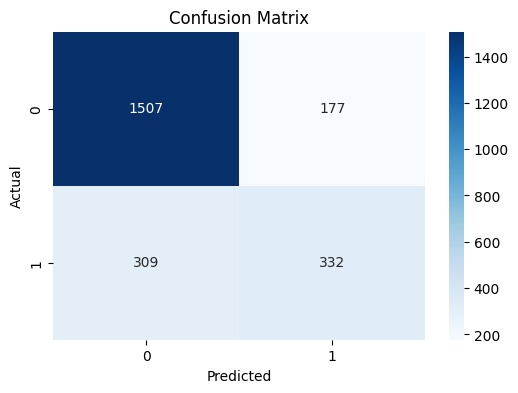
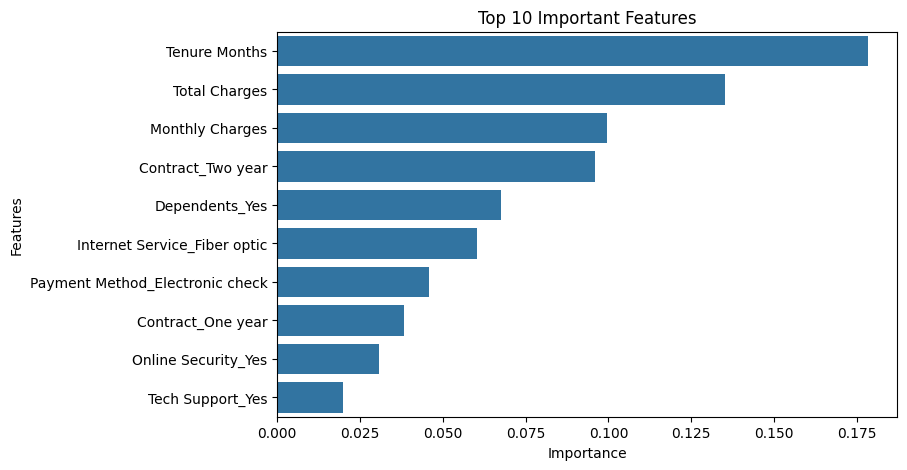
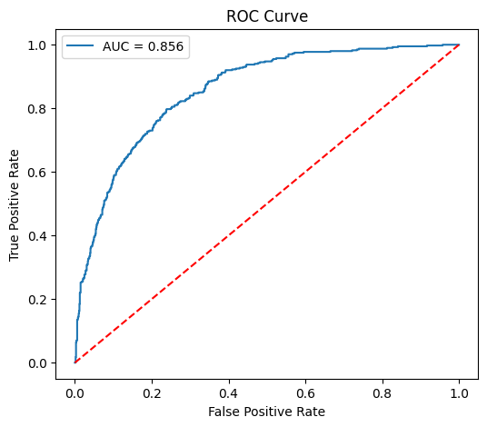
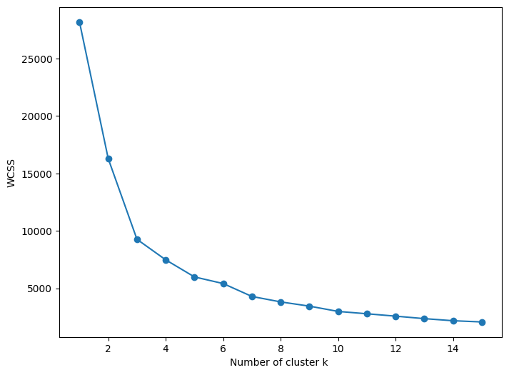
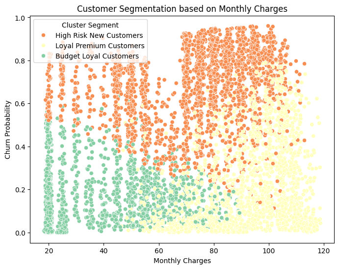
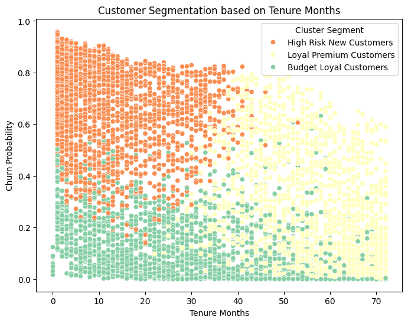
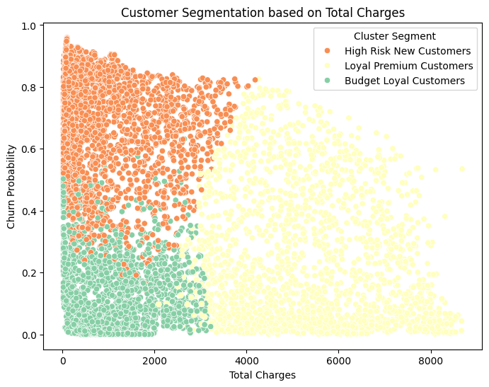

# customer-churn-prediction-segmentation
End-to-End Machine Learning project for Telecom Customer Churn Prediction and Customer Segmentation.

# Customer Churn Prediction & Customer Segmentation

## Objective

This project predicts telecom customer churn and segments customers into meaningful groups using Machine Learning.

## Technologies Used

- Python
- Pandas
- NumPy
- Scikit-Learn
- Matplotlib
- Seaborn

## Techniques Used

### Supervised Learning
- Random Forest Classifier
- Feature Importance Analysis
- Hyperparameter Tuning
- Cross Validation
- ROC-AUC Analysis

### Unsupervised Learning
- K-Means Clustering
- Elbow Method
- Customer Segmentation
 
# Dataset:
Telecom Customer Churn Dataset
# Source: 
Training Dataset provided during ML Internship.
## Key Results

- Predicted customer churn using telecom customer data.
- Identified important churn-driving factors.
- Segmented customers into:
  - Loyal Premium Customers
  - Budget Loyal Customers
  - High Risk New Customers

## Business Insights

- Lower tenure customers are more likely to churn.
- Monthly charges strongly influence churn probability.
- Long-term contract customers show lower churn rates.

# Visualizations

## Confusion Matrix

## Feature Importance

## ROC Curve

## Elbow Curve

## Customer Segmentation - Monthly Charges

## Customer Segmentation - Tenure Months

## Customer Segmentation - Total Charges

